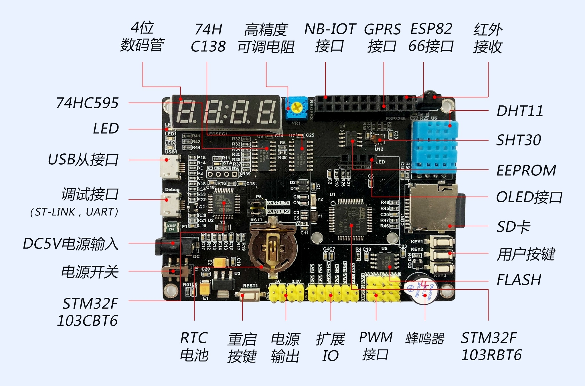

# MCU 开发技术

## 搭建 STM32 单片机开发环境

需要的软件工具：

- Keil MDK：MCU 开发 IDE
- 芯片支持包：Keil.STM32F1xx_DFP.2.4.1.pack
- STM32 CubeMX：初始化代码生成器，非必须，但能大幅度提高开发效率

> IAR：另一款流行的 MCU 开发 IDE

## 开发板硬件

主控芯片：STM32F103RBT6，LQFP64 封装，基于 ARM Cortex-M3 内核，最高主频率 72 MHz，RAM为20KB，Flash为128KB

STM32：ST 公司(意法半导体)推出的 32 位 MCU 芯片的统称。

MCU 芯片公司：ST、TI、NXP、SAMSUNG、瑞萨、高通等；兆易创新(GD32)、国民技术、比亚迪(车规级 MCU)等。

ARM 公司：只做微控制器(MUC)和微处理器芯片(MPU)的内核设计方案(IP)

产业链：内核设计(IP)-->芯片原厂-->设备-->方案-->服务

### ARM 内核架构方案：

- ARM Cortex-A：Application，用于微处理器(MPU)，面向高性能应用，如手机、PAD等。
- ARM Cortex-R：Real-Time，面向实时性要求很高的应用场景
- ARM Cortex-M：Micro-Controller，用于微控制器(MCU)，面向控制和简单计算
- ARM Cortex-S：Secure，面向安全性要求很高的应用场景

MCU：Micro Controller Unit，微控制器，俗称“单片机”，将 CPU、RAM、Flash、各种外设集成在一块芯片上。

51 单片机：基于 51 内核，通常都是 8 位的。

MCU 开发其实就是操作寄存器，51 单片机寄存器较少，并且寄存器都是 8 位的，直接操作寄存器很简单直接；但 32 位单片机寄存器数量庞大，并且寄存器都是 32 位的，直接操作寄存器很繁琐，也容易出错，所以 MCU 厂商为了提高开发效率，降低开发难度，通常都会提供一套库函数和相应开发工具，这套库函数封装了常用外设的各种操作功能，它们内部就是直接操作寄存器实现的，我们直接调用这些库函数就能轻松实现各种常用功能，无需亲自操作寄存器。

### ST 公司推出的两套函数库：

- 标准外设库(SPL)：已经停止更新，新项目不要使用！
- HAL 库：主推，适用于 ST 旗下的所有芯片。

### PCB 布局(Layout)和布线

- 先布局再布线
- 走线追求横平竖直，走钝角或圆角，不要走锐角和直角
- 一般信号线线宽 10mil 就行，主电源建议更宽(通常 20mil，根据电流大小定)
- 在一面无法走通就要用过孔到另一面走线

铺铜

泪滴

### 单片机外设

学习单片机只要就是学习它的各种外设，外设就是实现了某个功能的电路模块，如：GPIO、TIMER(定时器)、NVIC(嵌套向量中断控制器)、ADC、I2C、SPI、UART、CAN、DMA、RTC 等。

每个外设都对应一堆寄存器，读写这些寄存器就能够操作它们，几乎所有 32 位 MCU 厂商都提供了一套函数库，将常用外设寄存器操作封装成函数，供开发者调用，提高开发效率，降低开发难度。

ST公司提供了HAL库和LL库两套函数库，LL库几乎接近底层寄存器操作，效率很高，HAL库比LL库封装程度更高，效率较低，常规项目直接使用HAL库即可，对效率要求极高的项目可以使用LL库或直接操作寄存器。

> HAL：Hardware Abstraction Layer，硬件抽象层。

### 所有外设的统一操作步骤：

1. 使能(启用)外设时钟(__HAL_RCC_GPIOC_CLK_ENABLE())
2. 初始化(配置)外设
3. 对外设进行具体操作
4. 禁用(失能)外设时钟(如果不在需要使用该外设，降低功耗)

### GPIO

GPIO：General Purpose Input/Output，通用输入/输出，所有 MCU 都有的基础外设，应用非常广泛。

一个 MCU 具有多个 GPIO 控制器(如 GPIOA、GPIOB...等)，每个 GPIO 控制器负责控制最多 16 个引脚。相当于将所有引脚进行分组管理，每一组对应一个 GPIO 控制器，也称为 GPIO 端口(Port)，每个 GPIO 端口下面有最多 16 个引脚，分别从 0 开始编号(最大编号 15)，比如 PC13 表示端口 C (GPIOC) 下的 13 号引脚。

八种 GPIO 引脚工作模式：

- 推挽输出
- 开漏输出
- 复用推挽输出
- 复用开漏输出
- 浮空输入(高阻输入)
- 上拉输入
- 下拉输入
- 模拟输入(用于 ADC 输入通道)

输出：MCU 自己控制(改变)引脚上的电平状态(高电平或低电平)，从而影响(控制)外部电路。

输入：MCU 自己不控制(改变)引脚上的电平状态，让外部电路来控制(改变)引脚上的电平状态，MCU 只读取(检测)引脚上的电平状态，从而判断外部电路的状态变化。

GPIO 外设操作常用 HAL 库函数：

- HAL_GPIO_Init：初始化 (配置) GPIO 引脚
- HAL_GPIO_WritePin：控制某个 GPIO 引脚输出高电平或低电平
- HAL_GPIO_ReadPin：读取某个 GPIO 引脚上的电平状态
- HAL_GPIO_TogglePin：翻转某个 GPIO 引脚上的电平状态

> Pin ：引脚

HAL_Delay：毫秒级延时

位标志(Bit Flag)

主流 MCU 的每个引脚内部都集成了上拉电阻和下拉电阻，但默认通常是禁用的，可以通过配置相关寄存器启用，主要用于输入模式；这样不用外接上拉或下拉电阻，降低 BOM 成本。

GPIO 引脚输出速度是指电平翻转速度，有三档可选。

PWM：Pulse Width Modulation，脉宽调制技术，在数字电路中通过调节脉冲宽度(占空比)实现类似与模拟电路中对电压/电流的调制效果。

PWM 控制信号就是脉冲方波信号，重要参数：

- 周期
- 频率
- 占空比：在一个周期中，有效电平持续时间占整个周期的比例

PWM 技术广泛用与自动化控制领域，典型应用如照明亮度、温度控制、电机转速和角度控制等。

推挽输出(Push-Pull Poutput)：既能输出高电平，还能输出低电平(灌电流)，输出电流比较大(通常最大可达 20 mA)，可以直接驱动一些小负载(LED等)

开漏输出(Open Drain Output)：只能输出低电平(灌电流)，输出高电平时实际上输出的是高阻态(此时该引脚相当于悬空)，可以通过外接一个上拉电阻实现高电平输出。主要用于通信总线。

高阻态：既不是高电平，也不是低电平，相当于悬空。

蜂鸣器(Buzzer/Beep):

- 有源蜂鸣器：内部集成了振荡源电路，接通电源就能发声，驱动简单
- 无源蜂鸣器：内部没有振荡源电路，需要给它提供变化的电压/电流才能发声，只接通电源是不会持续发声的

MCU 可以通过输出 PWM 信号控制无源蜂鸣器发声，PWM 信号的频率决定了声音的频率，占空比决定了声音的响度

积累常见电子元器件：

- 电阻
- 电容
- 电感
- LED
- 蜂鸣器
- 开关
- 按键
- 数码管
- 三极管

三极管的作用：三个引脚分别是集电极(C)、基极(B)、发射极(E)，分为 NPN 型和 PNP 型两种，作用是开关和放大；有三种工作状态：截止、放大、饱和。

常用按键事件检测：

- 按下(Pressed)
- 松开(Rekeased)
- 奇偶次按
- 短按和长按
- 双击

### 常用传感器(Sensor)

光照传感器、烟雾传感器、水位传感器、温度传感器、压力传感器、心率传感器等。

### 常用执行器

LED、蜂鸣器、继电器、电机、电磁阀等。

#### 继电器(Relay)

继电器就是一个开关，可以实现通过一个电路(主控电路)控制另一个电路(被控电路)的通断

了解继电器工作原理，掌握继电器控制（高电平触发和低电平触发）和接线方法（COM、NC、NO）。

#### 数码管

实现数码管驱动

多位一体的数码管的引脚为：位选引脚和段选引脚

显示方式：

- 静态显示：
- 动态刷新显示

GPIO 引脚扩展

MCU 控制数码管的方案：

- 专用数码管驱动芯片
- I/O 扩展芯片:常见的有三八译码器(74HC138)，串行转并行(74HC)

E 号引脚 使能 引脚，带 — 低电平有效

数字芯片的用法套路：查阅它的 DS，搞清楚真值表

串行通信：多位数据在一条信道上逐位进行传输
并行通信：多位数据在多条信道上同时传输

上升沿和下降沿

数码管需要注意的问题：

- 消影
- 亮度均匀
- 避免闪烁

### 状态机(State Machine)

有限状态机

通常用一个枚举类型表示所有需要处理的状态。

当前状态
事件
响应
状态迁移

### 中断(Interruption)

MCU 三种编程模型：

- 查询(轮询)
- 中断(Interruption)
- DMA：Direction Memory Access，直接内存访问

中断时所有 MCU 都具有的重要功能，它可以让 MCU 对外部事件进行实时处理

中断机制是由中断控制器实现的，中断控制器(Interruption Controller)也是一个外设

中断控制器称为 NVIC (Nested Vectored Interrupt Controller, 嵌套向量中断控制器)

中断源(Interruption Source)

中断请求(Interruption Requet)

中断处理函数(中断服务程序，ISR)

一旦发生某个中断，在中断处理函数中需要将对应的中断标志位清零，否则会多次触发中断

中断处理函数一定要快速返回，不要在中断处理函数中进行耗时操作或复杂计算处理，中断处理函数中通常只设置全局标志，具体的处理在主函数中运行

#### 中断机制

**一旦某个外设(中断源)在某个时刻发生了某个事件(触发了某个中断)，中断控制器会立即检测到并向 CPU 发出中断请求，CPU 会立即暂停执行当前代码，转去执行中断处理函数(ISR，调用一次中断处理函数)，中断处理函数执行结束返回后 CPU 继续执行之前的代码(中断返回)。**

中断优先级(Interruption Priority)：优先级高的中断先处理，低的后处理。优先级就是一个非负整数，最小值为 0，值越小优先级越高， STM32 使用 4bit 表示中断优先级，支持 16 个中断优先级。中断优先级由抢占优先级和响应优先级构成。抢占优先级占高位的若干位，响应优先级占低位剩余位，共有 5 种不同的分配方案，称为 5 个不同的优先级分组(Priority Group)，即分组 0 到分组 4，分组 4 最常用，即抢占优先级占 4bit，响应优先级占 0bit，也就是只使用抢占优先级，不用响应优先级。

抢占优先级高的中断先处理，低的后处理；如果同时发生了若干个抢占优先级相同的中断，响应优先级高的先处理，低的后处理；如果响应优先级也相同，则按照中断向量表的先后顺序依次处理。如果 CPU 正在处理一个中断，此时发生了另一个抢占优先级相同的中断，无论响应优先级是什么都不会发生中断嵌套。

> 响应优先级也称子优先级

中断嵌套：在处理一个中断时发生了另一个更高优先级的中断，此时会暂停执行当前中断处理函数，转去执行新发生的中断处理函数，等这个中断处理完毕再接着处理之前的中断

中断向量表

所用外设都支持中断，如定时器超时中断、UART 接收中断、GPIO 引脚外部中断

#### 外部中断(EXTI,External Interruption)

GPIO 引脚产生的中断，支持三种出发方式：上升沿触发、下降沿触发、双边沿触发。 

编号相同的引脚共用一条外部中断线(EXTI Line)，总共有 16 条外部中断线(EXTI0 - EXTI 15)，如 3 号引脚共用 EXTI3，相同编号的引脚不能同时启用外部中断。

为了节省资源，STM32 的外部中断向量只有 7 个，如 EXTI2 对应的中断向量为 EXTI2_IRQHandler，EXTI5 - EXTI9 共用一个中断向量 EXTI9_5_IRQHandler,EXTI10 - EXTI15 共用一个中断向量 EXTI15_10_IRQHandler

弱函数(Weak Function)：使用 __weak 修饰的函数。弱函数会被同名的普通函数直接取代。

回调函数(Callback Function)：只需要定义函数，不需要显示调用，它会在发生某个事件或满足某个条件是系统自动调用。

高速缓存(Cache)：容量很小，若干 MB，读写速度比主内存更快

寄存器(Register)：CPU 内部自带的少量存储空间(通用寄存器)，用于暂存即将要运算的数据和中间运算结果，速度极快，和外设 寄存器不一样。

volatile 关键字：取消编译器优化，即告诉编译器不要优化对该变量或指针指向数据的访问(不要缓存它)，因为目标数据随时可能都会被改变(如在其它地方赋值、其他线程中改变、硬件电路、中断处理函数中等)，每次访问都必须从内存进行。

> volatile: 易变的