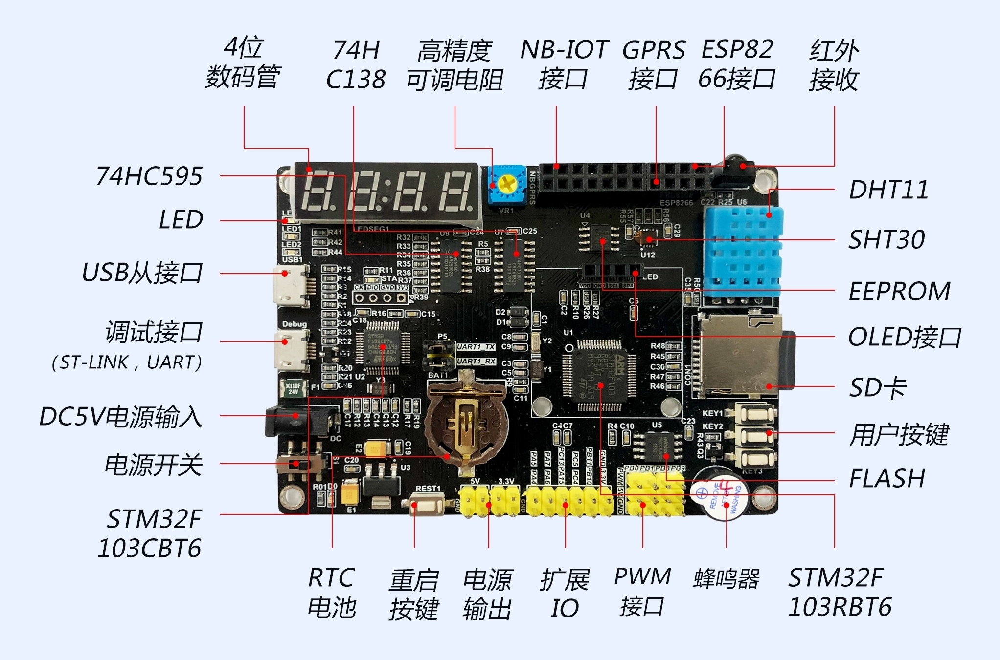
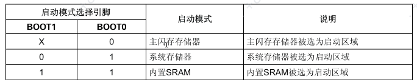
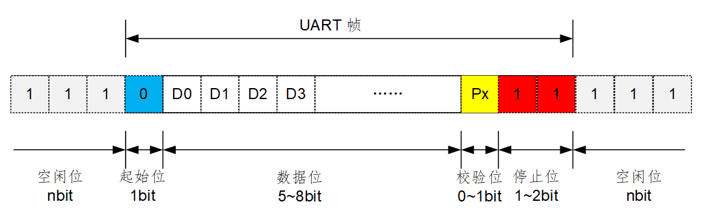

# MCU 开发技术


## 搭建 STM32 单片机开发环境


需要的软件工具：

- Keil MDK：MCU 开发 IDE
- 芯片支持包：Keil.STM32F1xx_DFP.2.4.1.pack
- STM32 CubeMX：初始化代码生成器，非必须，但能大幅度提高开发效率


> IAR：另一款流行的 MCU 开发 IDE


## 开发板硬件





主控芯片：STM32F103RBT6，LQFP64 封装，基于 ARM Cortex-M3 内核，最高主频率 72 MHz，RAM为20KB，Flash为128KB


STM32：ST 公司(意法半导体)推出的 32 位 MCU 芯片的统称。

MCU 芯片公司：ST、TI、NXP、SAMSUNG、瑞萨、高通等；兆易创新(GD32)、国民技术、比亚迪(车规级 MCU)等。


ARM 公司：只做微控制器(MUC)和微处理器芯片(MPU)的内核设计方案(IP)


产业链：内核设计(IP)-->芯片原厂-->设备-->方案-->服务


### ARM 内核架构方案：

- ARM Cortex-A：Application，用于微处理器(MPU)，面向高性能应用，如手机、PAD等。
- ARM Cortex-R：Real-Time，面向实时性要求很高的应用场景
- ARM Cortex-M：Micro-Controller，用于微控制器(MCU)，面向控制和简单计算
- ARM Cortex-S：Secure，面向安全性要求很高的应用场景


MCU：Micro Controller Unit，微控制器，俗称“单片机”，将 CPU、RAM、Flash、各种外设集成在一块芯片上。


51 单片机：基于 51 内核，通常都是 8 位的。


MCU 开发其实就是操作寄存器，51 单片机寄存器较少，并且寄存器都是 8 位的，直接操作寄存器很简单直接；但 32 位单片机寄存器数量庞大，并且寄存器都是 32 位的，直接操作寄存器很繁琐，也容易出错，所以 MCU 厂商为了提高开发效率，降低开发难度，通常都会提供一套库函数和相应开发工具，这套库函数封装了常用外设的各种操作功能，它们内部就是直接操作寄存器实现的，我们直接调用这些库函数就能轻松实现各种常用功能，无需亲自操作寄存器。


### ST 公司推出的两套函数库：

- 标准外设库(SPL)：已经停止更新，新项目不要使用！
- HAL 库：主推，适用于 ST 旗下的所有芯片。


### PCB 布局(Layout)和布线

- 先布局再布线
- 走线追求横平竖直，走钝角或圆角，不要走锐角和直角
- 一般信号线线宽 10mil 就行，主电源建议更宽(通常 20mil，根据电流大小定)
- 在一面无法走通就要用过孔到另一面走线


铺铜


泪滴


### STM32 最小系统需要重点关注

- 电源(Power)
- 外部时钟(HSE、LSE)
- 复位(Reset)
- 启动模式(Boot Mode)：有 Boot0 和 Boot1 引脚决定
- 调式(烧写程序)接口




### 单片机外设


学习单片机只要就是学习它的各种外设，外设就是实现了某个功能的电路模块，如：GPIO、TIMER(定时器)、NVIC(嵌套向量中断控制器)、ADC、I2C、SPI、UART、CAN、DMA、RTC 等。


每个外设都对应一堆寄存器，读写这些寄存器就能够操作它们，几乎所有 32 位 MCU 厂商都提供了一套函数库，将常用外设寄存器操作封装成函数，供开发者调用，提高开发效率，降低开发难度。


ST公司提供了HAL库和LL库两套函数库，LL库几乎接近底层寄存器操作，效率很高，HAL库比LL库封装程度更高，效率较低，常规项目直接使用HAL库即可，对效率要求极高的项目可以使用LL库或直接操作寄存器。


> HAL：Hardware Abstraction Layer，硬件抽象层。


### 所有外设的统一操作步骤：

1. 使能(启用)外设时钟(__HAL_RCC_GPIOC_CLK_ENABLE())
2. 初始化(配置)外设
3. 对外设进行具体操作
4. 禁用(失能)外设时钟(如果不在需要使用该外设，降低功耗)


### GPIO


GPIO：General Purpose Input/Output，通用输入/输出，所有 MCU 都有的基础外设，应用非常广泛。


一个 MCU 具有多个 GPIO 控制器(如 GPIOA、GPIOB...等)，每个 GPIO 控制器负责控制最多 16 个引脚。相当于将所有引脚进行分组管理，每一组对应一个 GPIO 控制器，也称为 GPIO 端口(Port)，每个 GPIO 端口下面有最多 16 个引脚，分别从 0 开始编号(最大编号 15)，比如 PC13 表示端口 C (GPIOC) 下的 13 号引脚。


八种 GPIO 引脚工作模式：

- 推挽输出
- 开漏输出
- 复用推挽输出
- 复用开漏输出
- 浮空输入(高阻输入)
- 上拉输入
- 下拉输入
- 模拟输入(用于 ADC 输入通道)


输出：MCU 自己控制(改变)引脚上的电平状态(高电平或低电平)，从而影响(控制)外部电路。

输入：MCU 自己不控制(改变)引脚上的电平状态，让外部电路来控制(改变)引脚上的电平状态，MCU 只读取(检测)引脚上的电平状态，从而判断外部电路的状态变化。


GPIO 外设操作常用 HAL 库函数：

- HAL_GPIO_Init：初始化 (配置) GPIO 引脚
- HAL_GPIO_WritePin：控制某个 GPIO 引脚输出高电平或低电平
- HAL_GPIO_ReadPin：读取某个 GPIO 引脚上的电平状态
- HAL_GPIO_TogglePin：翻转某个 GPIO 引脚上的电平状态


> Pin ：引脚


HAL_Delay：毫秒级延时


位标志(Bit Flag)


主流 MCU 的每个引脚内部都集成了上拉电阻和下拉电阻，但默认通常是禁用的，可以通过配置相关寄存器启用，主要用于输入模式；这样不用外接上拉或下拉电阻，降低 BOM 成本。


GPIO 引脚输出速度是指电平翻转速度，有三档可选。


PWM：Pulse Width Modulation，脉宽调制技术，在数字电路中通过调节脉冲宽度(占空比)实现类似与模拟电路中对电压/电流的调制效果。


PWM 控制信号就是脉冲方波信号，重要参数：

- 周期
- 频率
- 占空比：在一个周期中，有效电平持续时间占整个周期的比例


PWM 技术广泛用与自动化控制领域，典型应用如照明亮度、温度控制、电机转速和角度控制等。


推挽输出(Push-Pull Poutput)：既能输出高电平，还能输出低电平(灌电流)，输出电流比较大(通常最大可达 20 mA)，可以直接驱动一些小负载(LED等)


开漏输出(Open Drain Output)：只能输出低电平(灌电流)，输出高电平时实际上输出的是高阻态(此时该引脚相当于悬空)，可以通过外接一个上拉电阻实现高电平输出。主要用于通信总线。


高阻态：既不是高电平，也不是低电平，相当于悬空。


蜂鸣器(Buzzer/Beep):

- 有源蜂鸣器：内部集成了振荡源电路，接通电源就能发声，驱动简单
- 无源蜂鸣器：内部没有振荡源电路，需要给它提供变化的电压/电流才能发声，只接通电源是不会持续发声的

MCU 可以通过输出 PWM 信号控制无源蜂鸣器发声，PWM 信号的频率决定了声音的频率，占空比决定了声音的响度


积累常见电子元器件：

- 电阻
- 电容
- 电感
- LED
- 蜂鸣器
- 开关
- 按键
- 数码管
- 三极管


三极管的作用：三个引脚分别是集电极(C)、基极(B)、发射极(E)，分为 NPN 型和 PNP 型两种，作用是开关和放大；有三种工作状态：截止、放大、饱和。


常用按键事件检测：

- 按下(Pressed)
- 松开(Rekeased)
- 奇偶次按
- 短按和长按
- 双击


### 常用传感器(Sensor)


光照传感器、烟雾传感器、水位传感器、温度传感器、压力传感器、心率传感器等。


### 常用执行器


LED、蜂鸣器、继电器、电机、电磁阀等。


#### 继电器(Relay)


继电器就是一个开关，可以实现通过一个电路(主控电路)控制另一个电路(被控电路)的通断


了解继电器工作原理，掌握继电器控制（高电平触发和低电平触发）和接线方法（COM、NC、NO）。


#### 数码管


实现数码管驱动


多位一体的数码管的引脚为：位选引脚和段选引脚


显示方式：

- 静态显示：
- 动态刷新显示


GPIO 引脚扩展


MCU 控制数码管的方案：

- 专用数码管驱动芯片
- I/O 扩展芯片:常见的有三八译码器(74HC138)，串行转并行(74HC)


E 号引脚 使能 引脚，带 — 低电平有效


数字芯片的用法套路：查阅它的 DS，搞清楚真值表


串行通信：多位数据在一条信道上逐位进行传输
并行通信：多位数据在多条信道上同时传输


上升沿和下降沿


数码管需要注意的问题：

- 消影
- 亮度均匀
- 避免闪烁


### 状态机(State Machine)


有限状态机

通常用一个枚举类型表示所有需要处理的状态。


当前状态
事件
响应
状态迁移


### 中断(Interruption)


MCU 三种编程模型：

- 查询(轮询)
- 中断(Interruption)
- DMA：Direction Memory Access，直接内存访问


中断时所有 MCU 都具有的重要功能，它可以让 MCU 对外部事件进行实时处理

中断机制是由中断控制器实现的，中断控制器(Interruption Controller)也是一个外设

中断控制器称为 NVIC (Nested Vectored Interrupt Controller, 嵌套向量中断控制器)


中断源(Interruption Source)

中断请求(Interruption Requet)

中断处理函数(中断服务程序，ISR)


一旦发生某个中断，在中断处理函数中需要将对应的中断标志位清零，否则会多次触发中断

中断处理函数一定要快速返回，不要在中断处理函数中进行耗时操作或复杂计算处理，中断处理函数中通常只设置全局标志，具体的处理在主函数中运行


#### 中断机制


**一旦某个外设(中断源)在某个时刻发生了某个事件(触发了某个中断)，中断控制器会立即检测到并向 CPU 发出中断请求，CPU 会立即暂停执行当前代码，转去执行中断处理函数(ISR，调用一次中断处理函数)，中断处理函数执行结束返回后 CPU 继续执行之前的代码(中断返回)。**


中断优先级(Interruption Priority)：优先级高的中断先处理，低的后处理。优先级就是一个非负整数，最小值为 0，值越小优先级越高， STM32 使用 4bit 表示中断优先级，支持 16 个中断优先级。中断优先级由抢占优先级和响应优先级构成。抢占优先级占高位的若干位，响应优先级占低位剩余位，共有 5 种不同的分配方案，称为 5 个不同的优先级分组(Priority Group)，即分组 0 到分组 4，分组 4 最常用，即抢占优先级占 4bit，响应优先级占 0bit，也就是只使用抢占优先级，不用响应优先级。


抢占优先级高的中断先处理，低的后处理；如果同时发生了若干个抢占优先级相同的中断，响应优先级高的先处理，低的后处理；如果响应优先级也相同，则按照中断向量表的先后顺序依次处理。如果 CPU 正在处理一个中断，此时发生了另一个抢占优先级相同的中断，无论响应优先级是什么都不会发生中断嵌套。


> 响应优先级也称子优先级


中断嵌套：在处理一个中断时发生了另一个更高优先级的中断，此时会暂停执行当前中断处理函数，转去执行新发生的中断处理函数，等这个中断处理完毕再接着处理之前的中断


中断向量表


所用外设都支持中断，如定时器超时中断、UART 接收中断、GPIO 引脚外部中断


#### 外部中断(EXTI,External Interruption)


GPIO 引脚产生的中断，支持三种出发方式：上升沿触发、下降沿触发、双边沿触发。 


编号相同的引脚共用一条外部中断线(EXTI Line)，总共有 16 条外部中断线(EXTI0 - EXTI 15)，如 3 号引脚共用 EXTI3，相同编号的引脚不能同时启用外部中断。


为了节省资源，STM32 的外部中断向量只有 7 个，如 EXTI2 对应的中断向量为 EXTI2_IRQHandler，EXTI5 - EXTI9 共用一个中断向量 EXTI9_5_IRQHandler,EXTI10 - EXTI15 共用一个中断向量 EXTI15_10_IRQHandler


弱函数(Weak Function)：使用 __weak 修饰的函数。弱函数会被同名的普通函数直接取代。


回调函数(Callback Function)：只需要定义函数，不需要显示调用，它会在发生某个事件或满足某个条件是系统自动调用。


高速缓存(Cache)：容量很小，若干 MB，读写速度比主内存更快


寄存器(Register)：CPU 内部自带的少量存储空间(通用寄存器)，用于暂存即将要运算的数据和中间运算结果，速度极快，和外设 寄存器不一样。


volatile 关键字：取消编译器优化，即告诉编译器不要优化对该变量或指针指向数据的访问(不要缓存它)，因为目标数据随时可能都会被改变(如在其它地方赋值、其他线程中改变、硬件电路、中断处理函数中等)，每次访问都必须从内存进行。


> volatile: 易变的


### 时钟系统


时钟源(Clock Source)：负责输出时钟信号给其它外设，时钟信号就是脉冲方波。


时钟源：

- 内部时钟(Internal Clock)：通常通过 RC 振荡电路实现，MCU 内部集成，频率不够稳定，精度较低，温漂大。
- 外部时钟(External Clock)：通过晶振实现，频率稳定，精度高，温漂小。


单片机最小系统：

- 电源(Power)
- 时钟
- 复位


上电复位和手动复位。


### STM32 时钟树

STM32 有 5 个时钟源：

- HSE：High Speed External，高速外部时钟
- LSE：Low Speed External，低速外部时钟
- HSI：High Speed Internal，高速内部时钟
- LSI：Low Speed Internal，低速内部时钟
- PLL：锁相环（将输入时钟信号进行倍频处理后输出）

预分频(Prescaler)和倍频

AHB 总线：高级主机总线，连接 CPU、RAM、Flash 等高速设备
APB 总线：高级外设总线，用于连接各种外设，分为 APB1 和 APB2，它们都桥接到 AHB 总线上，APB2 > APB1，APB2 总线用于连接高速外设，APB1 用于连接低速外设

> Peripheral：外设
> Bus：总线

SYSCLK 的三个来源：

- HSE
- HSI
- PLL

LSE：可以作为 RTC 外设的时钟源
LSI：可以作为 RTC 和 IWDG 外设的时钟源

> RTC：Real Time Clock，实时时钟
> IWDG：Independent Watch Dog，独立看门狗

### 4定时器(Timer)

用于对输入时钟脉冲信号进行计数/计时的外设。

> 定时器其实就是一个计数器，每当有一个时钟脉冲到来，它的计数值就会加一个。

STM32F103RBT6 有四个 16 位定时器，TIM1 - TIM4，TIM1 是高级定时器，TIM2 - TIM4 是通用定时器。

如果定时器的输入时钟频率为 F，那么它的计数频率为：F / (PSC + 1)，计数周期为：(ARR + 1) * (PSC + 1) / F

Handle：句柄，指向目标对象的指针


重要参数：

- PSC：预分频系数
- ARR：自动重装载值

案例：使用定时器实现高精度微秒级延时（使用查询方式）


定时器常用功能：

- 定时/计数
- 比较输出(如输出 PWM 信号)
- 输入捕获(分析外部信号的时间特征，如计算外部信号的脉宽、频率/周期、占空比)


输出 PWM 信号的两种方案：

- 软件方式：直接控制 GPIO 引脚输出高低电平，兼容性好，但需要持续占用 CPU 资源，且输出的 PWM 信号精度较低
- 硬件方式：由定时器负责控制引脚输出 PWM 信号，无需占用 CPU 资源，精度高，但兼容性差


硬件 PWM 输出重要参数：

- 周期：(ARR + 1)*(PSC + 1) / F
- 占空比：Pulse / (ARR + 1)
- PWM Mode：模式 1 表示当前计数值小于 Pulse 时输出有效电平，否则输出无效电平，模式 2 相反
- CH Polarity：通道极性，即有效电平是啥


1 和 0 的信号编码


### 舵机开发


舵机(Servo):通常分为 180° 和 360° 两种


电机重要参数：

- 转速
- 扭矩


SG90 和 MG90S 需要的 PWM 信号

- 频率必须是 50 Hz，周期必须是 20 ms
- 脉宽（一个周期内部高电平持续时间）决定摆动角度，0.5 ms 表示 0°，1.5 ms 表示 90°，2.5 ms 表示 180°


MOS 管：电压控制型晶体管，也是由三极构成：栅极、源极、漏极，通过栅极电压控制漏极和源极之间的导通，分为 N 沟道型和 P 沟道型两种。


电池容量： mAh，毫安时


开漏输出和推挽输出内部电路实现。

> 开漏(Open Drain)：漏极开路

常用电机分类：

- 舵机(Servo)
- 直流减速电机
- 步进电机
- BLDC（无刷直流电机）

直流减速电机：俗称 130 电机、TT 马达、小马达，转速高，扭矩小，适合风扇、小车等。

> 电机：Motor，马达

电机驱动芯片：TB6612、DRV8833、L298N 等。


### ADC


Analog Digital Convertor，模数转换器，MCU 的重要外设之一，作用就是将模拟量(连续变化的电压值)转换为数字量(若干位二进制数字)


STM32F103RBT6 有 2 个 12 位的 ADC，即精度/分辨率为 12 位的，每个 ADC 支持 16 个外部通道。


ADC 参考电压 Vref，如果目标电压为 0 V，转换得到的数字量就是 0 ；如果目标电压为 Vref(通常为 3.3V)，转换得到的数字量就是 4095


掌握具体电压值和数字量之间得到换算方法。


ADC 典型应用：电池电量检测、电压表、示波器、各种模拟传感器等


ADC 重要参数：

- Data Alignment：数据对齐方式
- Sampling Time：一次采样时间，采样时间越长数据越准


掌握单通道和多通道采集的实现方法。


ADC采集数据总在跳动的原因和解决方案：

- 硬件上ADC 电源应该独立，并且使用高精度电源，不然会影响ADC 参考电压值
- 采样电路应该做好滤波和防干扰处理
- 软件滤波处理，如：均值滤波等


### 串行通信(Serial Communication)


常用串行通信技术：

- 单总线(1-Wire)
- I2C(IIC)
- SPI
- UART(串口、TTL/RS232/RS485)
- USB(Universal Serial Bus,通用串行总线)
- CAN
- Ethernet(以太网)
- ..........


### I2C


I2C：IIC，Inter-Integrated Circuit,集成电路内部通信总线，广泛应用于芯片与外设之间的通信。


I2C的特点：

- 二线制：SCL(Serial Clock,串行时钟)和SDA(serial Data,串行数据)，SCL是时钟线，SDA是数据线
- 串行通信
- 同步(Sync)：参与通信的双方或多方必须使用相同时钟
- 采用主从方式通信，支持一主一从，一主多从，多主多从通信方式
- 通信速度慢(标准模式下 100KHz，快速模式下 400KHz)


所有的主机和从机都并联到 I2C 总线上，每次通信只能由主机(Master)发起，并且时钟信号只能由主机提供，从机(Slave)只能被动接受通信。在同一条 I2C 总线上所有从机都必须由一个唯一的从机地址(7 位或 10 位的数据)，主机是通过从机地址选择与某个从机进行后续的通信。


I2C 总线上要接上拉电阻，保证在总线空闲时为高电平，还能实现线与。


> IC：Integrated Circuit，集成电路，即芯片


三种通信方式：

- 单工通信：数据只能单向传输，只有一条信道。
- 半双工通信：数据可以双向传输，但必须分时进行，只有一条信道。
- 全双工通信：数据可以同时进行双向传输，必须两条信道。


通信协议(时序)：每次通信必须由主机发起，并且时钟信号也由主机产生。主机首先发出开始信号，接着发出从机地址和读写方向位，每个从机都接收到了主机发送的从机地址和读写方向位，让后和自己的地址进行比较，如果相同就会发出响应信号，否则保持静默。主机接受到某个从机的应答信号后就开始后续的通信，以字节为单位进行收发，每接受到一个字节后可以发出应答信号(ACK)或非应答信号(NACK)，非应答信号通常用于表示数据接受都收完、不想继续通信了。主机可以发出结束信号，结束本次通信。


I2C通信实现的两种方式：

- 软件 I2C：控制 GPIO 引脚输出 I2C 通信需要的各种信号。
- 硬件 I2C：通过控制 I2C 外设(MCU 内部一个独立的电路,通过寄存器控制)实现输出 I2C 通信需要的各种信号。


实战：从零实现 I2C 驱动


I2C 一次开始信号通常对应一次结束信号，也可以多次开始信号只对应一次结束信号(主要用于切换读写方向)。


I2C 驱动分为两层：

- I2C 总线驱动(必须严格遵守标准 I2C 协议实现)
- I2C 设备驱动(必须查阅目标设备的数据手册，严格按照它的通信协议实现，需要调用 I2C 总线驱动)


实战：采集 SHT30 传感器的数据(I2C 设备驱动)


SHT30：温湿度传感器，I2C 接口。


#### 硬件 I2C


操作 I2C 外设的寄存器实现，无需关注通信时序细节处理，I2C 外设硬件已经实现。


I2C 外设相关 HAL 库函数：

- HAL_I2C_Master_Transmit
- HAL_I2C_Master_Receive


我们开发板所用的 OLED 显示屏参数：0.96寸，分辨率 128 * 64，驱动芯片为 SSD1306


驱动移植


坐标原点在左上角


### SPI


SPI：Serial Peripheral Interface，串行外设接口，摩托罗拉推出的一种通信总线。


SPI 的特点：

- 标准 SPI 是四线制：SCLK(时钟信号线,同步通信)、MOSI(Master Output Slave Input,主机输出从机输入)、MISO(Master Input Slave Output,主机输入从机输出)、CS/SS(Chip Select,片选信号线,也称Slave Select,主机通过这根线选择某个从机进行后续通信,通常低电平有效)
- 全双工
- 同步
- 串行
- 通信速度快(可以达到几十兆赫兹)
- 支持一主一从、一主多从、多主多从通信方式


SPI 典型应用场景：

- TFT 小彩屏
- SPI Flash
- 数据量大、实时性要求高的传感器


SPI 总线架构


每次通信必须由主机发起，时钟信号必须由主机产生。主机通过片选信号选择目标从机通信，没有被选中的从机保持静默。


CPOL：Clock Polarity,时钟极性，决定空闲时时钟电平状态，有两种情况高电平或低电平。

CPHA：Clock Phase,时钟相位，决定采样时刻，如果为 0 表示在第一个边沿进行采样，为 1 表示在第二个边沿进行采样。


根据 CPOL 和 CPHA 不同，SPI 有四种工作模式：

- Mode 0:CPOL = 0 , CPHA = 0
- Mode 1: CPOL = 0 , CPHA = 1
- Mode 2: CPOL = 1 , CPHA = 0
- Mode 3: CPOL = 1 , CPHA = 1


在实际项目中具体采用哪种工作模式要看从机数据手册，从机支持那种工作模式就用那种模式 0 和模式 3 最常用。


SPI 通信的实现方式：

- 软件 SPI
- 硬件 SPI


实战：实现 SPI 总线驱动(软件方式)


实战：通过硬件 SPI 方式访问 Flash 存储器


硬件 SPI 外设操作相关 HAL 函数：

- HAL_SPI_Transmit
- HAL_SPI_Receive


### UART(串口)


UART：Universal Asynchronous Receiver Transmitter，通用异步收发器，MCU 的重要外设之一，用于和各种外部设备进行通信(包括 PC 机)，如指纹传感器、北斗/GPS 定位模块、WIFI 模块、BLE 模块、Lora 模块


> Sync：同步
>
> Async：异步


串口的特点：

- 两根数据线：RXD、TXD。RXD 用于接受数据，TXD用于发送数据，双方必须交叉连接和共地
- 异步
- 全双工
- 通信速度(由波特率决定，较慢)


必须记住：不同电路或芯片一起工作时必须共地。


串口通信数据帧格式




串口通信重要参数：

- 波特率(Baud)：bps，每秒多少位，决定了串口通信的速率。
- 起始位(通常 1 位)
- 数据位(通常是 8 位)
- 校验位(无校验、奇校验、偶校验)
- 停止位(通常 1 位)


必须记住：要想串口通信正常，收发双方必须采用完全一样的参数配置。


串口通信经典参数配置：115200 8N1


串口通信的实现方式：

- 软件方式
- 硬件方式


STM32F103RBT6 由三个串口外设。


> USART：Universal Synchronous Asynchronous Receiver Transmitter，通用同步/异步收发器
>
> UART：Universal Asynchronous Receiver Transmitter，通用异步收发器


ESP8266：中国乐鑫公司推出的 WIFI 芯片。


ESP8266支持三种工作模式：

- Station
- AP
- AP + Station


ESP8266 只支持 2.4 GHz 的 WIFI 网络。


通过串口 AT 指令配置 ESP8266 模块：

- 工作模式 Station
- WIFI 网络的 SSID 和 Password
- 目标服务器和端口 

通过串口调试助手可以控制 PC 机的串口(USB 转串口)进行通信


上位机软件：通常是 PC 机上的软件，控制串口与下位机(MCU 等设备)通信，实现控制、配置、采集数据等功能。


ESP8266 需要执行的 AT 指令：

```C
# 串口通信测试
AT

# 将 ESP8266 模块恢复出厂设置
AT+RESTORE

# 将 ESP8266 模块设置为 Station 模式
AT+CWMODE=1

# 控制 ESP8266 模块连接目标 WiFi 网络
AT+CWJAP="dengjun","embed_cba.1024"

# 控制 ESP8266 模块连接我们的云端平台（物联网云平台）
AT+SAVETRANSLINK=1,"47.97.81.90",9413,"TCP"

# 重启 ESP8266
AT+RST
```


 

> 注意：一条 AT 指令通常要以\r\n结束(即回车换行符)